# Commandline-Interface-Test-App
This app is to check the python programming skill as well as experience with managing APIs

# Installation & Run
- Make sure you set up Python3 on your system (note: I assumed that your OS is a Linux OS)
- Clone this app from the github: [app](https://github.com/adnan-soft-pro/Commandline-Interface-Test)
- Create a virtualenv and activate it like so (only one time):
    ```bash
    python3 -m venv venv
    source venv/bin/activate
    ```
- Use the package manager [pip](https://pip.pypa.io/en/stable/) to install necessary packages in the requirements.txt
    ```bash
    pip install -r requirements.txt
    ```
- Run this app like so:
    ```bash
    python main.py
    ```
# How does this app work?
- When you run the script, you can see the output in the terminal like so:
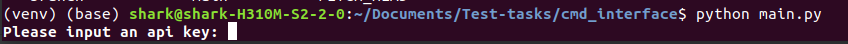
- After you entering the api key, you are asked to enter a keyword to search for matching symbols through API
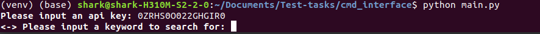
- Once you enter a keyword and press Enter in the terminal, you can see a list of symbols with company names and are asked to select a company:
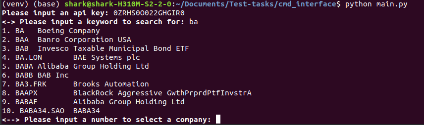
- There, you input an id of a company and press Enter. Then, you are asked to input another selection number to display different data for a chosen company:
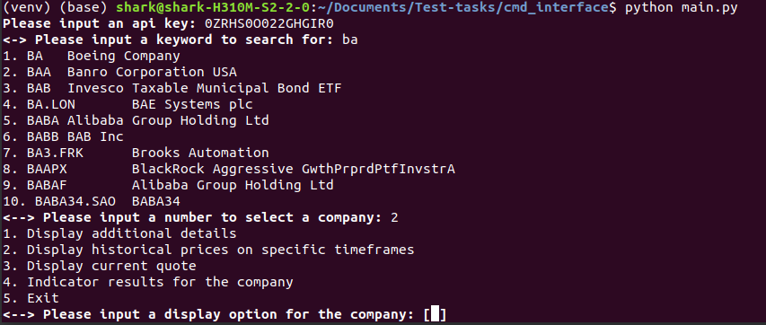
- Finally, you can see different data for a chosen company by entering different options in the terminal:
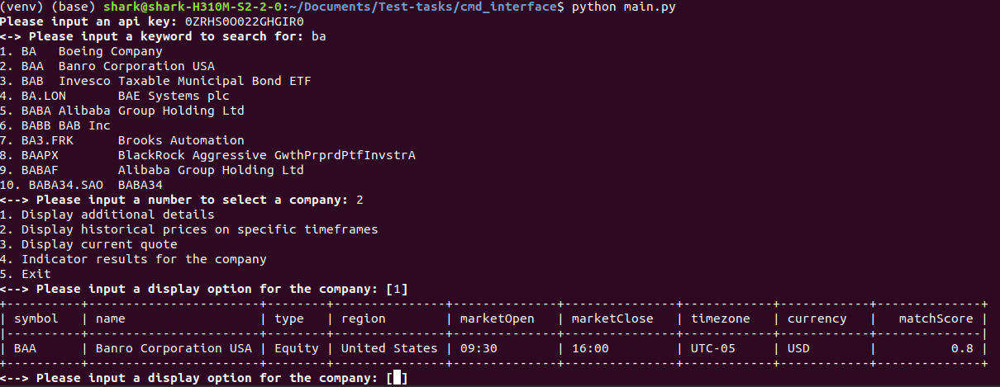
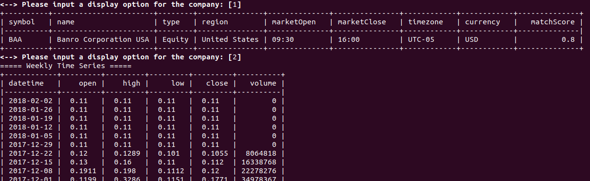
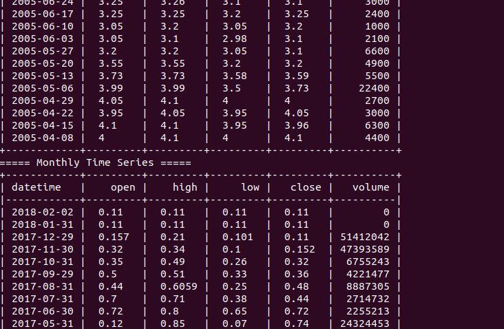
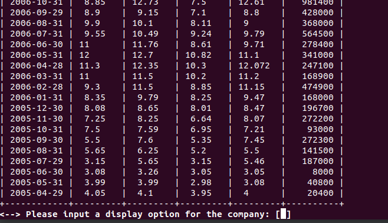
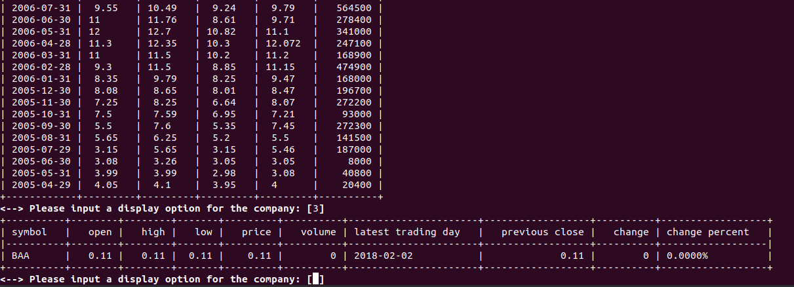
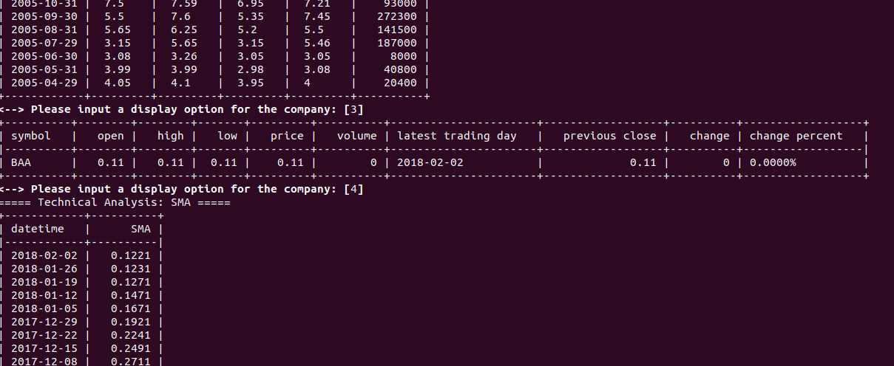
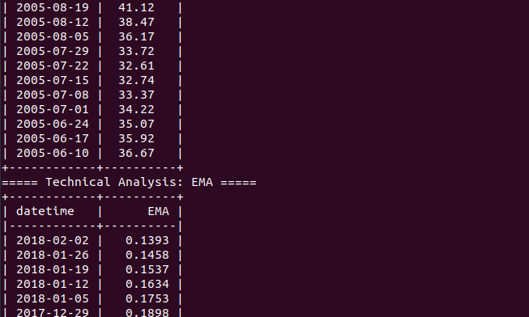
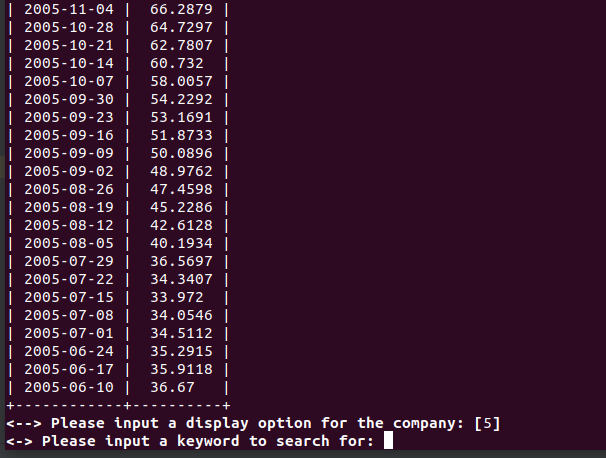
- Additionally, if you enter nothing for a keyword and an api key, you will get out from the app like so:
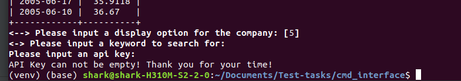
